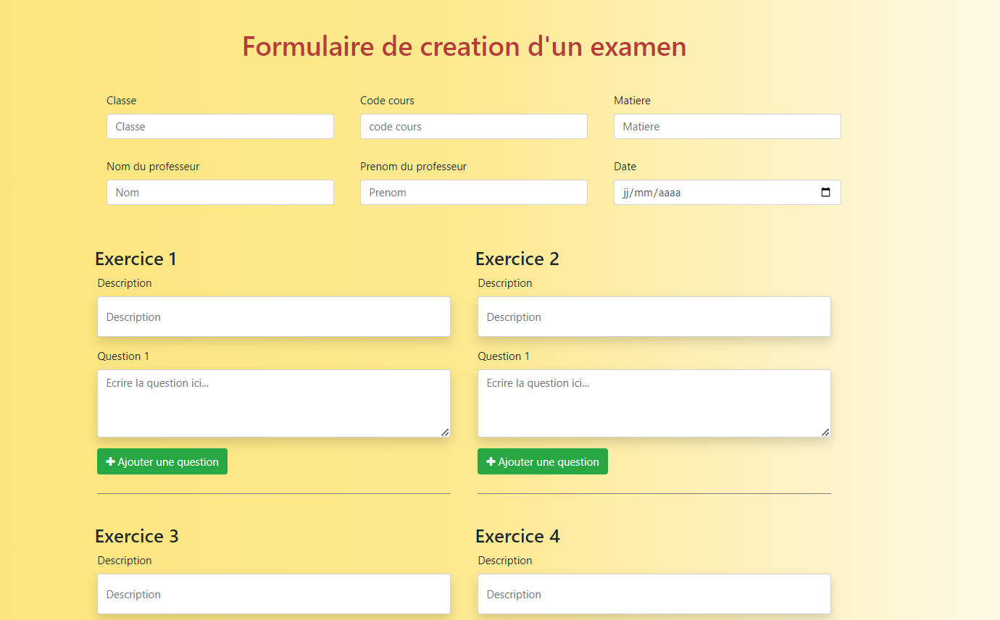
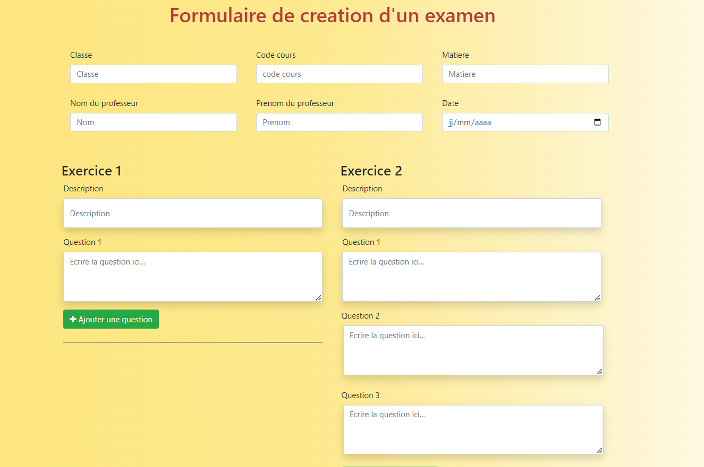
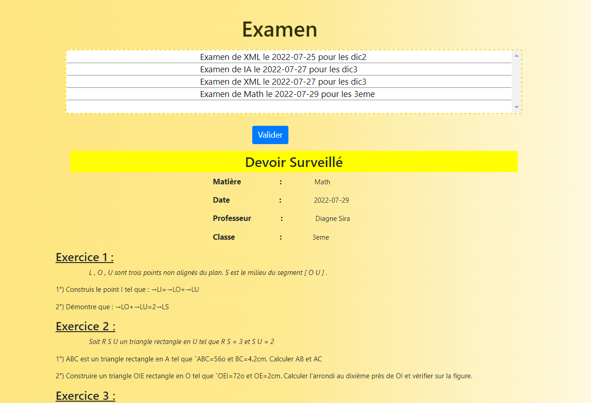
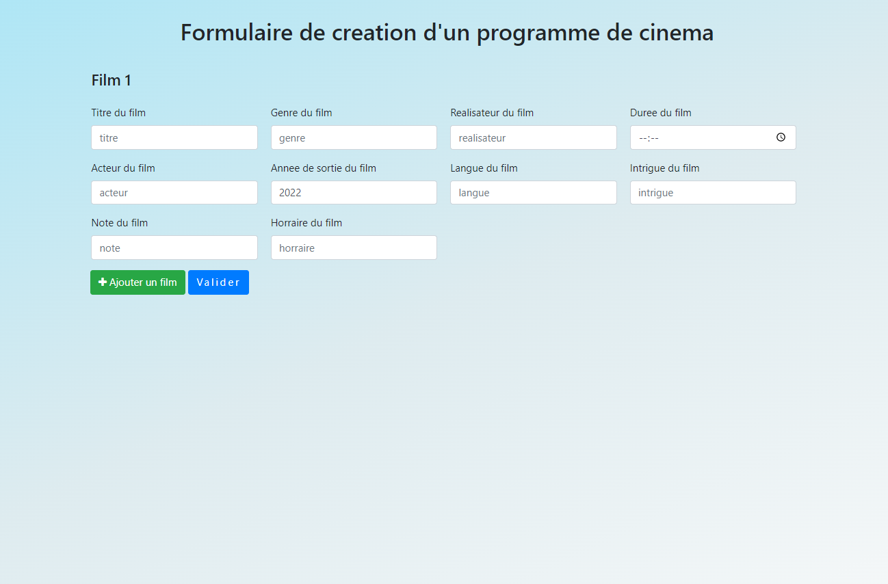
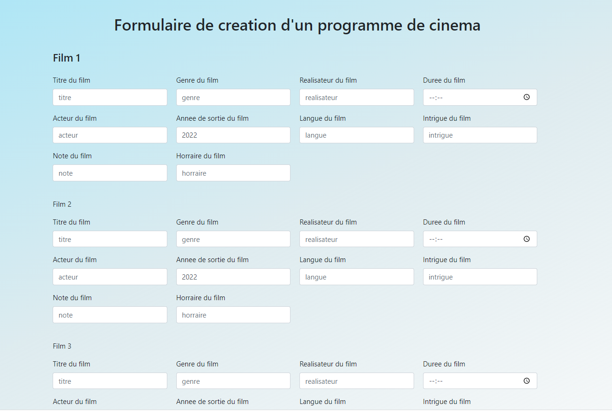
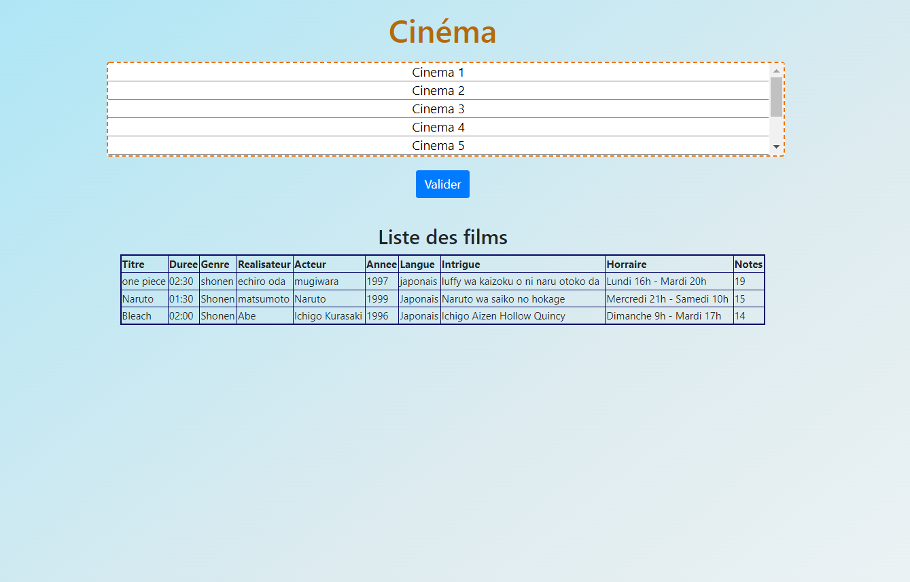
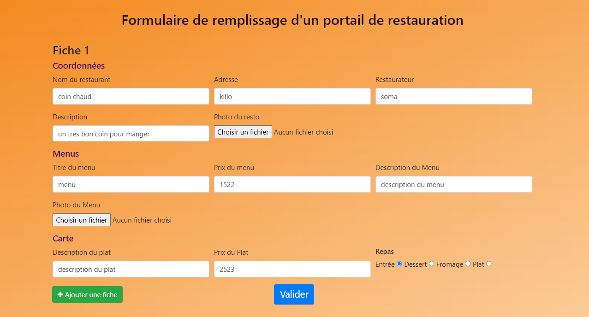
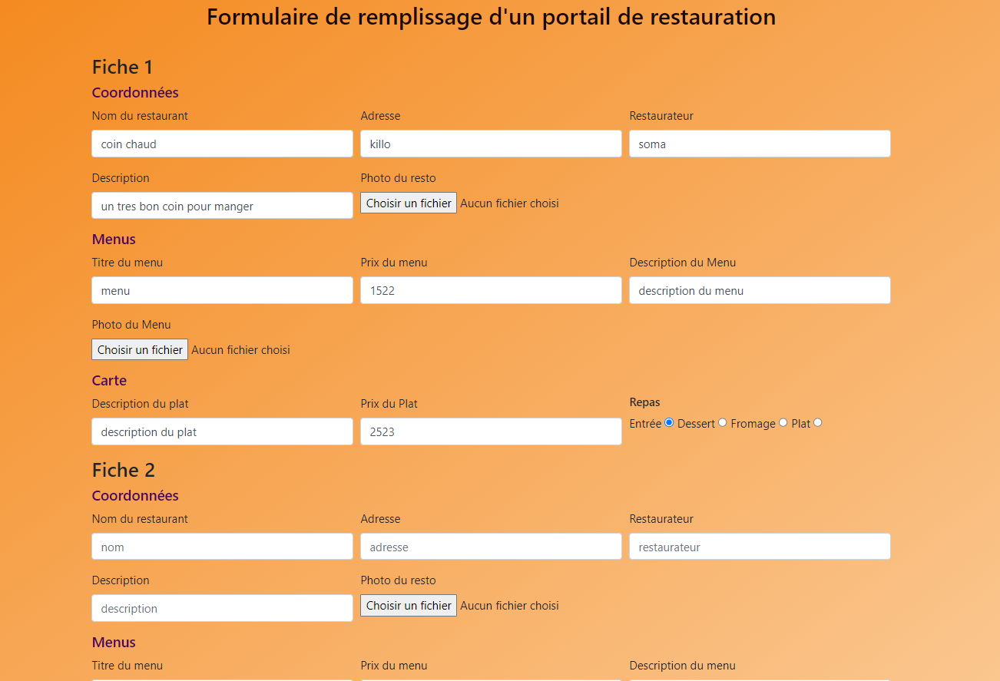
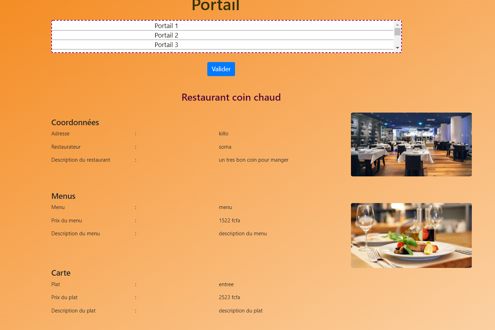

# Gerer-des-documents-xml-avec-php
>Ce projet consiste à gerer des programmes de cinéma, des examens de classes et des fiche de restaurant. il existe deux profils un profil admin qui crée les programmes qui doivent être conforme avec la dtd. Un profil visiteur qui visualise les programmes crée par l'administrateur. SimpleXml permet de gerer les fichiers xml avec php.

## Screenshots
##Examen
&nbsp;&nbsp;&nbsp;&nbsp;&nbsp;&nbsp;&nbsp;&nbsp;&nbsp;&nbsp;
##Cinema
&nbsp;&nbsp;&nbsp;&nbsp;&nbsp;&nbsp;&nbsp;&nbsp;&nbsp;&nbsp;
##Portail
&nbsp;&nbsp;&nbsp;&nbsp;&nbsp;&nbsp;&nbsp;&nbsp;&nbsp;&nbsp;

## Project Status
Project is: _Complete_

